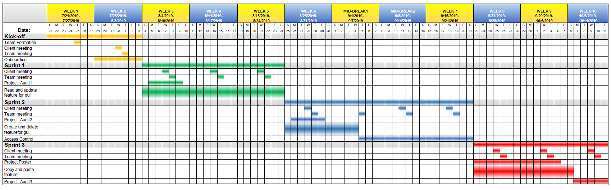
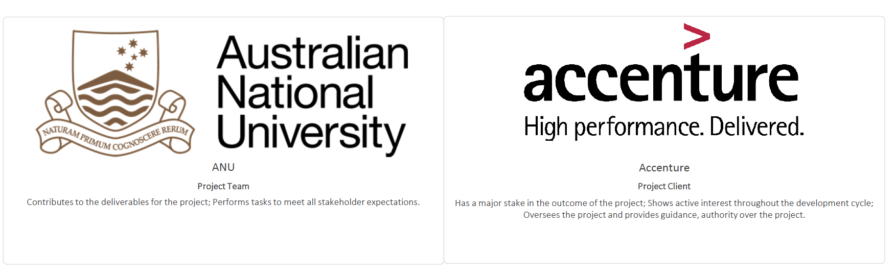
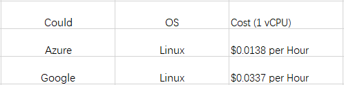

# Million-coursework
This project will upgrade the former course selection project in many fields including improving Graphical User Interface (GUI), offering access control for ANU stuff and former bugs fixing. Students could select personalized course depending on their interaction with website and give feedback to ANU stuff directly. 

The Intelligent Course Scheduler is coming soon!

## Table of Contents

1. [Team Members](#team-members)

2. [Tools and Services](#tools-and-services)

3. [Milestones](#milestones)

4. [Project Schedule](#project-schedule)

5. [Process Changes](#project-changes)

6. [Client's Vision](#clients-vision)

7. [Key Stakeholders](#key-stakeholders)

8. [Client and Stakeholder Expectations](#client-and-stakeholder-expectations)

9. [Project Impact](#project-impact)

10. [Technical and Other Constraints](#technical-and-other-constraints)

11. [Resources, Risks and Potential Costs](#resources-risks-and-potential-costs)

12. [NDA and IP Concerns](#nda-and-ip-concerns)

13. [References](#references)

## Team Members

## Tools and Services
**Project Repository-github repo-"million-coursework":** https://github.com/million-coursework   

**Team communication tool-Slack channel：** https://millioncourse.slack.com  

**Task management: Trello board "Million Course Project":** https://trello.com/b/NZ6f3hWP/million-course-project  

**Contribution management: Google excel:** https://docs.google.com/spreadsheets/d/1VDyPTPGakaePHO59xfDXeRE0bjdDeTqzyIgMXlnG3V4/edit?usp=sharing  

**Related links:**
GitHub organisation "AICourseSelection"：  https://github.com/AICourseSelection

Thanks to the advice provided by our clients, what tool to choose can work more efficiently.
Thanks also to the inspiration that our clients have brought us, and we have established a way to calculate the contribution fairly so that everyone in our team can contribute to the project.  

## Milestones
The plan for this semester includes five main work objectives. They are, in a rough order of priority, as follows:
1. **Graphical User Interface**:The graphical user interface is a form of user interface. Good Gui can bring a better user experience. Our job is to improve the existing user interface and add some features.
2. **CRUD**:Create, read, update, and delete (CRUD) are the four basic functions for this website. The website will read the data from the database and provide the information the user needs.These functions are the basis of access control system.
3. **Access control**: Access control allow anu staffs to login into the website and change course information. Website administrators can also modify the database by using this system.
4. **Copy and paste functions**: Copy and paste functions are advanced functions for the website. Students can copy existing timetable from other students or template. These function can help students complete their study plan faster.
5. **Bug fixing**: There are some bugs in the website. For example,  in some situations, the website will generate incomplete timetable. Our job is to fix these bugs.

## Project Schedule

* **Kick-Off**: Weeks 1 - 2. Team member recruitment, onboarding, project definition and setup. 
* **Sprint 1**: Weeks 3 - 5. Project Audit 1,graphical user interface,bug fixing. 
* **Sprint 2**: Weeks 6 - 7. Project Audit 2, CRUD functions,copy function and bug fixing. 
* **Sprint 3**: Weeks 8 - 10. Project Audit 3,paste function,access control and bug fixing.

  
## Process Changes

## Client's Vision

## Key Stakeholders

## Client and Stakeholder Expectations
* Accenture
  * Upgrade more functions and optimize the scheduler .
* The Australian National University
  * Manage the system by access control function and get students' feedback.
  * The team will meet all project requirements within the timeline. 
  * Demonstrate the better GUI and control system could make students get better experience of course selection.
## Project Impact
The aim of this project is to upgrade the former course selection project for university students. Good GUI could bring a better experience to students. Compared with invisible code, the graphical user interface could be viewed directly. In fact, optimizing the GUI of course selection system allows university students to retrieve information more efficiently. In addition, we will work on access control, which could help Anu staff to manage the course information easier. There are some bugs existing in course selection system at presents and we will focus on fixing them. Eventually this project could mainly bring students three benefits in summary.

1. Students will be able to experience a better user interface which will make their course selection clear and efficient. The access control function allows Anu staff update the course information as soon as possible which will bring more convenience to students.

2.  For some specific majors, some bugs occur when students select course and this website can not be used normally on the mobile services. After fixing these bugs, it could bring a better experience for university students.

3. We believe that this project will encourage students to explore more about courses and enable students to consider a greater number of options when enrolling. As a result, the proposed project would enhance student experience and university life.

## Technical and Other Constraints
 The system could now scrap data accurately and efficiently, and we have our own database. However, one thing leave to us is that in order to keep the database up to date, we might need to update it manually, prerequisites change in different years and degrees, we need the latest data to provide a rationally AI system to arrange the degree. Meanwhile, students may start degrees in different semesters, different degrees may have different requirements and rules. Thus, strategies should vary based on different situations or the the data we acquire should be formatted in an universal form.
 
Further more, We are currently lack of consideration in safety and access control. Students should only see the courses in their own degrees and one may only have access to their own data, meanwhile the data should be maintained separately and safely when constructing the database. On the other hand, course conveners or professors may need to see how students arrange their courses each semester so that appropriate resources can be allocated in specific area.

## Resources, Risks and potential Costs
For our project, all of the resources of codes and how it works are from our client. Then for the could service, we plan to use one of the three services in the budget table below. We have noticed that there are some potential risks in the following aspects. Firstly, there are always some uncontrollable factors in our work. We must define the due time of each small tasks. It is better to allocating enough time for each task and make sure that every member done their work on schedule. Once someone can not finish their work on time, there should be some extra time for this issue. Secondly, we should guarantee the highest quality of our product in the shortest time. Some mistakes would reduce quality, for example, working on the hardest or the not important tasks first. Thirdly, relationship between teammates is also a kind of risks. Members who are not happy with their teammates would not working hard and reduce the communication among the team, then fail the project.

Here is a table shows our budget:

## NDA and Ip Concerns

## References
Galitz, W. O., & Safari Books Online. (2007). The essential guide to user interface design: An introduction to GUI design principles and techniques (3rd ed.). Indianapolis, IN: Wiley Pub.
