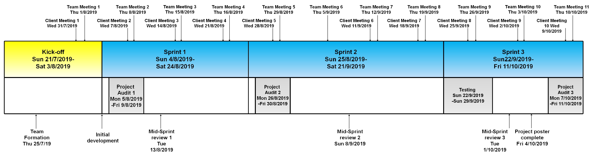

# Million-coursework
This project will enhance the former Intelligent Course Scheduler project in the Customization Interface area so that the ANU Student Services staff could maintain the data. This enhancement will consist of three sub-feature namely CRUD (Create, Read, Update and Delete) functions, Duplicate feature, and Access Control function.

### [Statement of Work](Documentation/Audit1/PDF/Statement%20of%20work,%20initialed.pdf)
### [Semester 2 Project Progress](Documentation/overview.md)

## Table of Contents

1. [Team Members](#team-members)

2. [Tools and Services](#tools-and-services)

3. [Milestones](#milestones)

4. [Project Schedule](#project-schedule)

5. [Client's Vision](#clients-vision)

6. [Key Stakeholders](#key-stakeholders)

7. [Client and Stakeholder Expectations](#client-and-stakeholder-expectations)

8. [Project Impact](#project-impact)

9. [Technical and Other Constraints](#technical-and-other-constraints)

10. [Resources, Risks and Potential Costs](#resources-risks-and-potential-costs)

11. [NDA and IP Concerns](#nda-and-ip-concerns)

12. [References](#references)

## Team Members

## Tools and Services
**Project Repository-github repo-"million-coursework":** https://github.com/million-coursework/million-coursework 

**Team communication tool-Slack channel：** https://millioncourse.slack.com  

**Task management: Trello board "Million Course Project":** https://trello.com/b/NZ6f3hWP/million-course-project  

**User Story Point Calculator: Google excel:** https://docs.google.com/spreadsheets/d/1VDyPTPGakaePHO59xfDXeRE0bjdDeTqzyIgMXlnG3V4/edit?usp=sharing  

**Burn Down Chart:** https://drive.google.com/open?id=1YXpoZipWnUfFZUe16BZG64oZYpVcX1il

Thanks to the advice provided by our clients, what tool to choose can work more efficiently.
Thanks also to the inspiration that our clients have brought us, and we have established a way to calculate the contribution fairly so that everyone in our team can contribute to the project.  

## Milestones
The plan for this semester includes one main work objective includes some sub-objectives. They are, in a rough order of priority, as follows:
1. **Customisation Interface**:Customisation Interface will allow ANU staffs to login into the website and modify the data (Major, Minor, Spesialisation). This feature includes the graphical user interface and database operations
     * **CRUD**:Create, read, update, and delete (CRUD) are the four basic functions for the customisation interface. The website will read the data from the database and provide the information the user needs.These functions are the basis of access control system.
     * **Duplicate feature**: Duplicate function is advanced function for the customisation interface. ANU staff can duplicate existing degree requirements in the database and paste them into the new semester. This function can help ANU staff manage the system more efficient.
     * **Access control**: Access control allow specific user maintain specific data only. This function could help managing the database and course information.

## Project Schedule

* **Kick-Off**: Weeks 1 - 2. Team member recruitment, project definition and setup. 
* **Sprint 1**: Weeks 3 - 5. Project Audit 1, onboarding, read and create feature for customisation interface. 
* **Sprint 2**: Weeks 6 - 7. Project Audit 2, update and delete feature for customisation interface, access control.
* **Sprint 3**: Weeks 8 - 10. Project Audit 3, duplicate feature and project poster.

## Client's Vision
Our mission statement is to transform the way students discover and explore their options at university. The Intelligent Course Scheduler, currently known as ANU ICS, offers interactive degree planning and personalised course discovery to make picking courses simple and enjoyable for students. It uses machine learning to recommend courses to students, and provides university administrators with a structured data model of the entire system of courses, majors, and degree requirements.

As it stands, the product is easily usable by students and has been well-received. However, it is still a proof of concept (POC) and still stands to be improved upon in many areas. Our primary goal for this semester is to improve and streamline the ICS to a point where it can be safely and easily handed over to the ANU for simple upkeep. Following this MVP, we envision the product to improve in other auxiliary areas, providing new functionality and quality of life.
Some of these features include:
* Improving the recommendation algorithms
* Dynamically auto-generated degree plans for students
* More useful information about courses (like reviews)
* Providing enrolment metrics to ANU staff
* Streamline administration tasks like graduation and timetabling
* Improved plan saving and sharing system

## Key Stakeholders

* ANU Student Service Staff as the user for manage the programs.
* ANU Students as the user.
* Joseph and Safeer as the client.

## Client Expectations
  * Regular and timely communication.
  * Strong team motivation, teamwork and self-direction.
  * Critical thinking about project design and direction.
  * Delivery of a fully-featured and robust product.
  * Responsibility for maintenance of the live product.
  
## Project Impact
The aim of this project is to upgrade the former course selection project for university students.One of important feature is customization for ANU Staff. Customization includes GUI and database operations like(CRUD). At first, good GUI could bring a better experience to students. Compared with invisible code, the graphical user interface could be viewed directly. In addition, We will work on access control, which could help ANU staff to manage the course information easier. There are some bugs existing in course selection system at presents and we will focus on fixing them. Eventually this project could mainly bring students three benefits in summary.

1. Students will be able to experience a better user interface which will make their course selection clear and efficient. The access control function allows Anu staff update the course information as soon as possible which will bring more convenience to students.

2.  For some specific majors, some bugs occur when students select course and this website can not be used normally on the mobile services. After fixing these bugs, it could bring a better experience for university students.

3. We believe that this project will encourage students to explore more about courses and enable students to consider a greater number of options when enrolling. As a result, the proposed project would enhance student experience and university life.

## Technical and Other Constraints
The system could now scrape data accurately and efficiently, and we have our own database. However, one thing leave to us is that in order to keep the database up to date, we might need to update it manually, prerequisites change in different years and degrees, we need the latest data to provide a rationally AI system to arrange the degree. However, we are completely new to the project, and there are many codes and technics that we are not familiar with. Working as a team, we will communicate with clients and they will help us through. Apart from that, since we are a new team, we still need some time to know each other, communication and arguments might be other constraints for us.

Furthermore, we are currently lack of consideration in safety and access control. Students should only see the courses in their own degree and one may only have access to their own data, meanwhile the data should be maintained separately and safely when constructing the database. On the other hand, we have responsibility to fix the bugs immediately while developing the system for guaranteeing a great user experience of intelligent Course Scheduler.

## Resources, Risks and potential Costs
For our project, all the resources of codes and how it works are from our client. Another helpful resource for us is that our client could help us to get in touch with CECS，and CECS could help us to do the testing. we would also get feedbacks from the testing. Then, for the cloud server, we plan to use one of the three servers in the budget table below. What's more, CECS has offered to pay for server costs.

We have noticed that there are some potential risks in the following aspects:
* There are always some uncontrollable factors in our work. We must define the due time of each small tasks. It is better to allocating enough time for each task and make sure that every member done their work on schedule. Once someone cannot finish their work on time, there should be some extra time for this issue.
* We should guarantee the highest quality of our product in the shortest time. Some mistakes would reduce quality, for example, working on the hardest or the not important tasks first. We use plan poker to allocate our tasks, and make sure that we put the most important task at first.
* Relationship between teammates is also a kind of risks. Members who are not happy with their teammates would not working hard and reduce the communication among the team, then fail the project.
* Studying new things would take us some time. To avoid the problems such as wasting too much time on learning the difficult knowledge, it is better for us to learn about what knowledge we need for the project in advance.

Based on our situation, we are not a special team, which means that each of us must working on this project at least 10 hours per week. We also must pay for the cloud server for our product. The cloud server would be free for a few months，then we could apply for the Techlauncher grant.

Here is a table shows our budget for the cloud server:

## NDA and Ip Concerns
There will be no non-disclosure agreement required. 

Any materials, tools, methods/techniques and software provided by Clients advised and agreed to be Clients’ Copyright, will remain the intellectual property of Clients. New codes developed by project members will be owned by project team.

## References
Galitz, W. O., & Safari Books Online. (2007). The essential guide to user interface design: An introduction to GUI design principles and techniques (3rd ed.). Indianapolis, IN: Wiley Pub.

SFIA Foundation (2017). Levels of responsibility. Retrieved from https://www.sfia-online.org/en/framework/sfia-7/busskills
